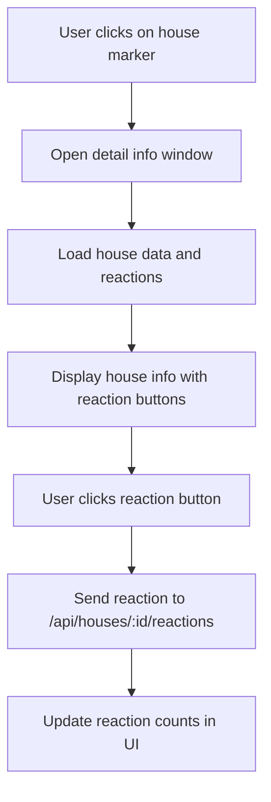

# Plan to Move Reactions from Comments to Houses

## Current System Analysis

- Reactions are currently implemented on individual comments
- Database: `comment_reactions` table with comment_id, reaction_token, reaction
- Frontend: Reaction buttons appear under each comment in the info window
- Backend: Routes for `/api/houses/comments/:commentId/reactions`

## Proposed Changes

### 1. Database Schema

Modify existing `comment_reactions` table to support house reactions:

```sql
ALTER TABLE comment_reactions ADD COLUMN house_id INT NULL;
ALTER TABLE comment_reactions ADD CONSTRAINT fk_house_reactions_house_id
  FOREIGN KEY (house_id) REFERENCES houses(id) ON DELETE CASCADE;
ALTER TABLE comment_reactions ADD UNIQUE KEY unique_house_reaction (house_id, reaction_token);
```

### 2. Backend Changes

- Modify existing routes in `server/routes/houses.js`:
  - `GET /api/houses/:id/reactions` - Get reactions for a house (new)
  - `POST /api/houses/:id/reactions` - Add/update reaction to house (new)
  - `DELETE /api/houses/:id/reactions` - Remove user's reaction from house (new)
  - Update comment reaction routes to handle house_id column
- Update Top 5 query to count house reactions instead of comments

### 3. Frontend Changes

- Modify `openDetail` function in `public/app.js`:
  - Add reaction buttons for the house itself (above comments section)
  - Remove reaction buttons from individual comments
- Update API calls to use house reaction endpoints
- Update Top 5 display to show reaction counts

### 4. Migration Steps

1. Add `house_id` column to `comment_reactions` table
2. Update backend code to handle house reactions
3. Update frontend code to show reactions on houses
4. Test the new system

## Workflow Diagram



## Implementation Order

1. Database schema modification (add house_id column)
2. Backend route updates for house reactions
3. Frontend reaction UI move from comments to houses
4. Top 5 query update
5. Testing

This plan moves reactions completely from comments to houses as requested.
